<p align="center">
  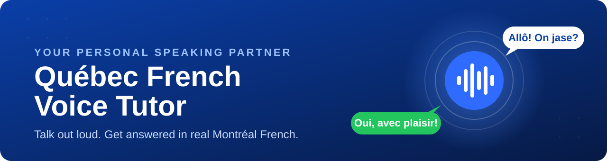
</p>

<p align="center">
  <b>Press one button, speak French out loud, and a patient tutor answers in natural Québec French.</b><br>
  It remembers your level, your mistakes and your progress from one call to the next.
</p>

<p align="center">
  
  
  
</p>

<p align="center">
  <a href="#how-to-use-it"><b>How to use it</b></a> ·
  <a href="#step-1--get-your-free-gemini-api-key"><b>Install</b></a> ·
  <a href="#-your-privacy"><b>Privacy</b></a> ·
  <a href="#troubleshooting"><b>Troubleshooting</b></a> ·
  <a href="#using-the-tutor"><b>Features</b></a> ·
  <a href="#-send-feedback"><b>Feedback</b></a> ·
  <a href="#for-developers"><b>Developers</b></a>
</p>

## What it does

- 🎙️ **Real conversation.** You speak, it answers out loud, straight away. No typing, no recording and uploading.
- 🍁 **Québec French.** Montréal accent and expressions: *dépanneur*, *tantôt*, *pis*, *il fait frette*.
- 🧠 **Remembers you.** Your level, recurring mistakes and new words carry over to the next call.
- ⌨️ **Read along live.** The transcript is written out as you both speak, and the tutor can put a multiple-choice question on screen — answer out loud, by typing, or by clicking.
- 📈 **A real program.** A 12-level syllabus (Échelle québécoise), lessons, role-plays and level checks.
- 🐢 **Patient.** Waits through your pauses. Beginners get English help; French-only comes later.
- 🔒 **Private.** Runs on your computer. Only the call itself goes to Google's Gemini.

## Get started in 3 steps

| | Step | Time | Guide |
| :-: | --- | :-: | --- |
| **1** | 🔑 Get a free Gemini API key | 2 min | [Step 1](#step-1--get-your-free-gemini-api-key) |
| **2** | 💻 Paste one line to install | 5 min | [Windows](#step-2-windows--install-and-start) · [Mac](#step-2-macos--install-and-start) |
| **3** | 🗣️ Double-click the Desktop icon and talk | now | [How to use it](#how-to-use-it) |

You don't need a paid account, Git, or any programming tools.

---

## How to use it

Once it's installed, this is all you do. Every time.

<table>
  <tr>
    <th width="25%">1. Open it</th>
    <th width="25%">2. Press Start</th>
    <th width="25%">3. Talk</th>
    <th width="25%">4. Hang up</th>
  </tr>
  <tr>
    <td valign="top">Double-click <b>Quebec French Tutor</b> on your Desktop. A window opens, then your browser.</td>
    <td valign="top">Press the big <b>Start Conversation</b> button. The tutor greets you.</td>
    <td valign="top">When the circle is <b>green</b>, speak. Take your time; it waits through pauses.</td>
    <td valign="top">Say <i>"on arrête"</i> or press <b>End Conversation</b>. Your progress is saved.</td>
  </tr>
  <tr>
    <td>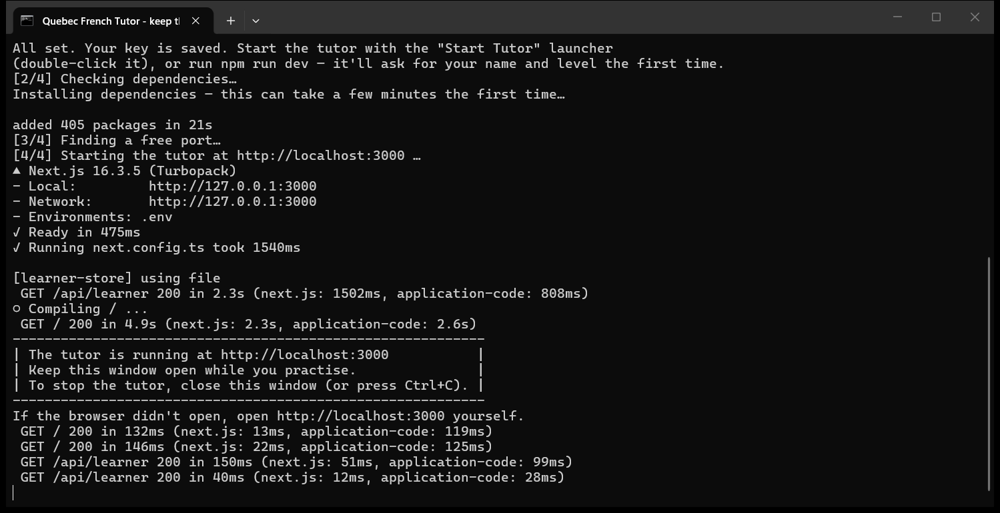</td>
    <td>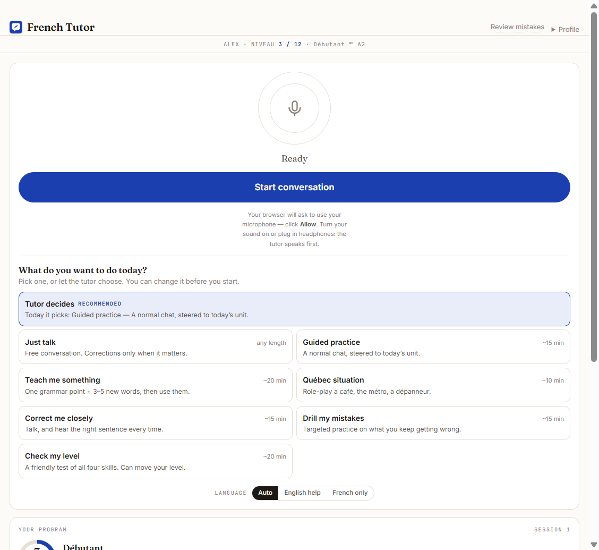</td>
    <td>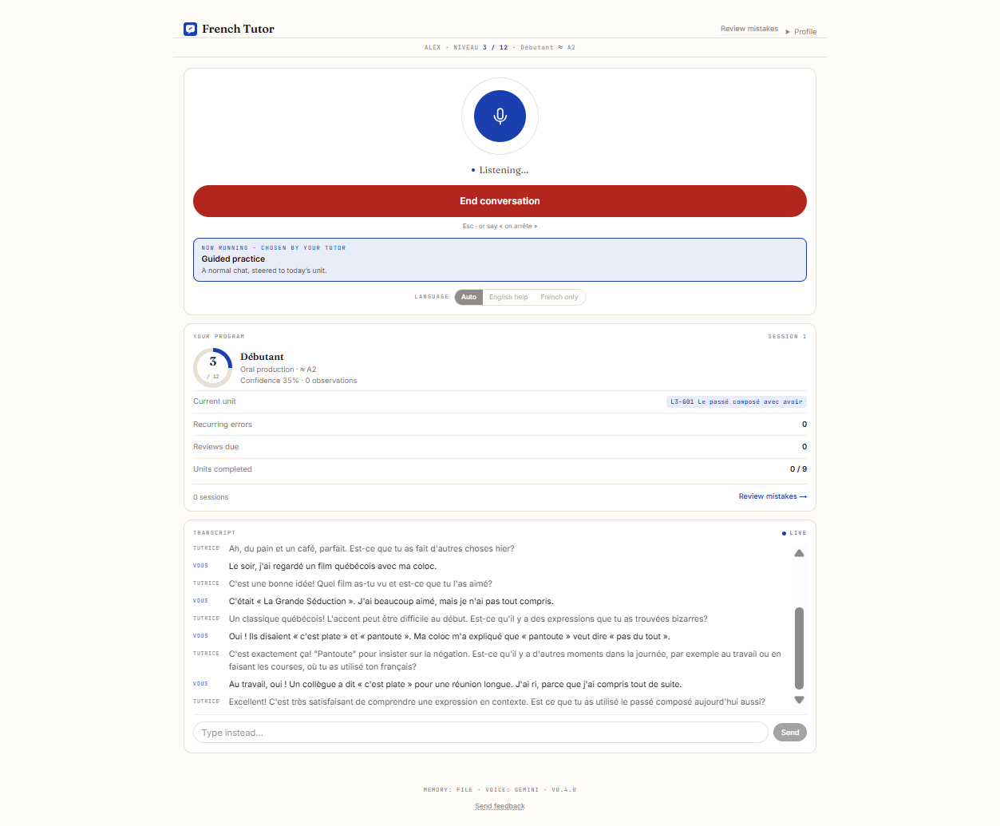</td>
    <td>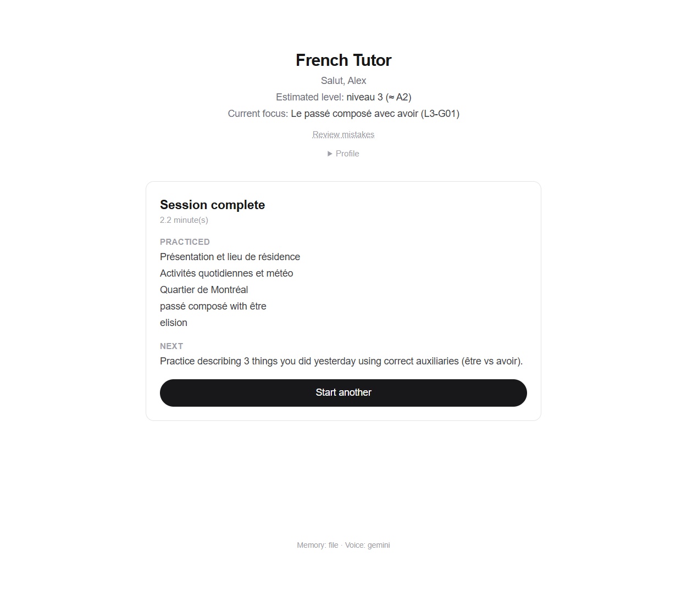</td>
  </tr>
</table>

**The circle tells you who's talking:**

| Circle | Means | You… |
| --- | --- | --- |
| 🔵 **Blue** (*Speaking…*) | the tutor is talking | listen |
| 🟢 **Green** (*Listening…*) | your turn | answer out loud, in French or English |

**Handy things to say during a call:**

| Say | What happens |
| --- | --- |
| *"Explain in English"* | the tutor switches to English to explain |
| *"On continue en français"* | back to French |
| *"On arrête"* / *"I have to go"* | the tutor says goodbye and the call ends |

**When you're done for the day,** close the tutor window (the one that opened when you
double-clicked the icon). Your progress is already saved.

> [!TIP]
> Wear **headphones**: the tutor then can't hear itself. And you can type instead of
> speaking at any time, in the box under the transcript.

Your very first call has two extra one-time questions (your name and level). See
[Your first conversation](#step-3--your-first-conversation) for a walk-through with pictures.

---

## What you need

- ✅ A **Windows 10/11** PC or a **Mac** (macOS 12 or newer, Apple Silicon or Intel).
- ✅ An **internet connection**, and about **1 GB of free disk space**. The first start
  downloads a few hundred MB; later starts need the internet only for the calls.
- ✅ A **microphone** and **speakers or headphones**. A laptop's built-in ones work;
  headphones stop the tutor from hearing itself.
- ✅ **Google Chrome** or **Microsoft Edge**. These are the browsers we tested; see
  [Browsers](#browsers).
- ✅ A **Google account** (Gmail) to get the free API key.

You do **not** need to install Node.js, Git or Python. The installer downloads a private
copy of Node.js (the engine that runs the tutor) inside the tutor's own folder, only if
your computer doesn't already have a recent one. Nothing is installed system-wide and no
administrator password is needed.

---

## 🔒 Your privacy

**Everything stays on your computer. I don't collect anything.**

There is no account, no sign-up, no server of mine anywhere in this app. The tutor runs
on your machine, at `http://localhost:3000` — a web page that only your computer can
open. Nobody else can reach it, including me.

What is stored, and where:

| What | Where it lives |
| --- | --- |
| Your name, level and progress | `data` folder inside the tutor's folder, on your disk |
| Your Gemini API key | `.env` file in the same folder, on your disk |
| Recordings of your voice | **Nowhere.** Audio is streamed for the call and never written to disk |
| Raw transcripts of your calls | **Nowhere.** Only short learning notes (error patterns, words, level estimates, a few summary lines) are kept |

What leaves your computer, and only while you are using it:

- **Your speech and the tutor's replies go to Google's Gemini** during a call, and the
  call's notes go to Gemini once at the end so it can write your progress summary. That
  is the service doing the talking and the reviewing; it is governed by
  [Google's API terms](https://ai.google.dev/gemini-api/terms). Use of a **free** Gemini
  API key means Google may use that content to improve their models — if that matters to
  you, use a paid Gemini key or a key from a Google Cloud project with paid billing.
- **Nothing else.** No analytics, no telemetry, no crash reporting, no "phone home".
  The only other network calls the app ever makes are: checking GitHub for a newer
  version (it asks for one file, `package.json`, and sends nothing about you), and
  sending feedback — but only if *you* type a message and press Send.

I never receive your key, your progress, your recordings or your transcripts. If you
send feedback, I get exactly the text you typed, plus your email address only if you
chose to give one.

**To delete everything:** delete the **Quebec French Tutor** folder. That's it — nothing
is left anywhere else, and nothing remains on any server of mine because it was never
there. (See [Uninstalling](#stopping-updating-and-uninstalling) to also revoke the key.)

---

## Step 1 — Get your free Gemini API key

The tutor uses Google's Gemini for the voice and for reviewing your calls. An **API key**
is a password-like code that lets the tutor use Gemini on your behalf. It is free.

1. Open **<https://aistudio.google.com/apikey>** in your browser.
2. **Sign in** with your Google account.

   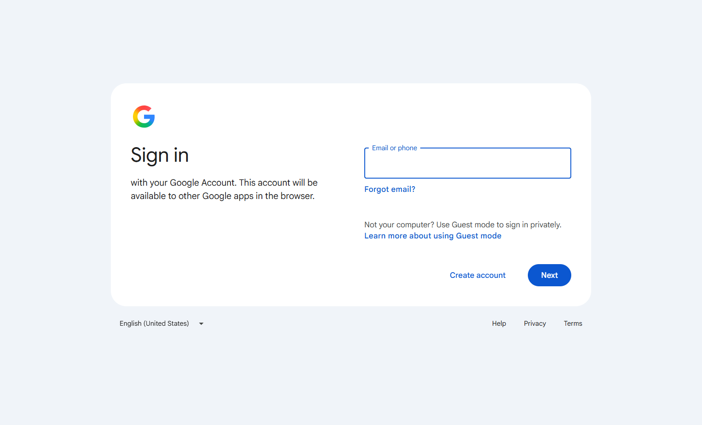

3. The first time, Google AI Studio asks you to accept its terms: tick the box(es) and
   continue. If a cookie banner appears, click **Agree** or **No thanks** (either is fine).
4. You are now on the **API Keys** page. New accounts often already have a key listed,
   called *Default Gemini API Key*. You can use it (skip to step 7), or make a new one:
   click **Create API key** at the top right.

   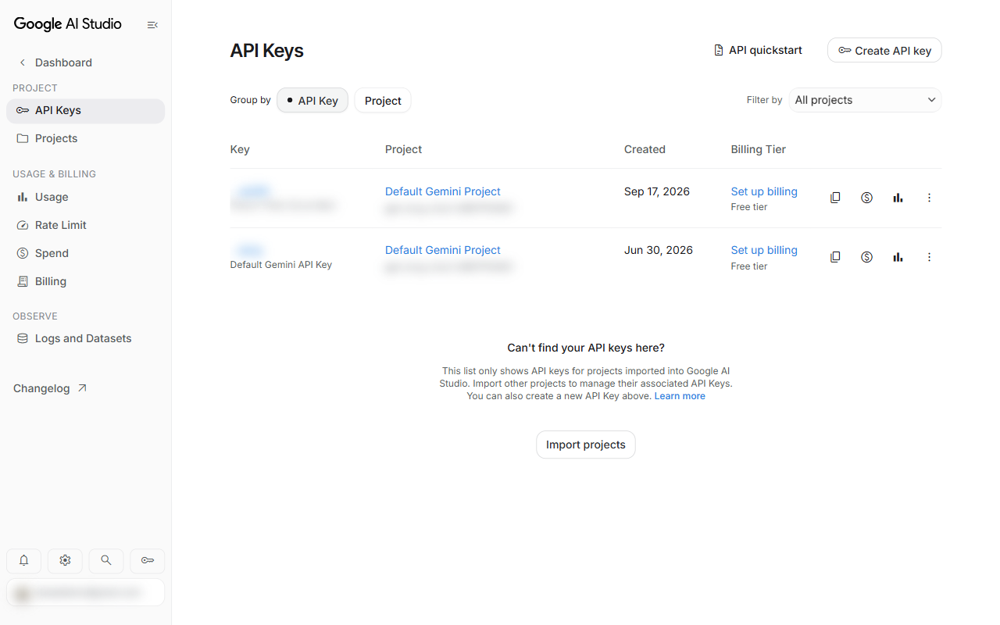

5. In the **Create a new key** box, type any name (for example `French tutor`), leave the
   project as it is (*Default Gemini Project*), and click **Create key**.

   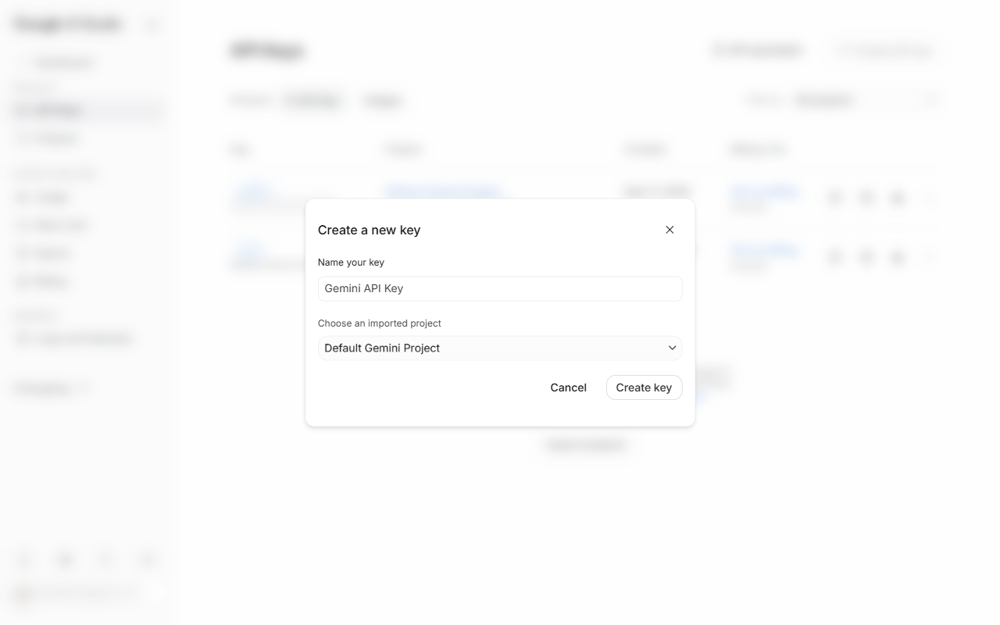

6. The **API key details** window shows your key (blurred in this picture).
7. Click **Copy key**. For an existing key, click the copy icon (two overlapping
   squares) in its row. The key is now on your clipboard and ready to paste in step 2.

   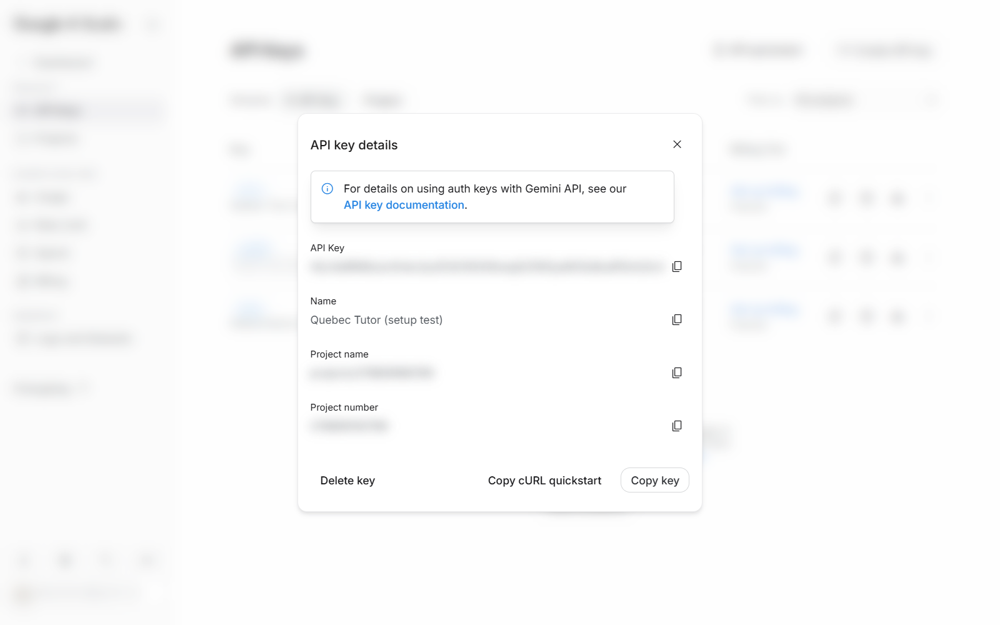

**What the key looks like.** New keys are about 50 characters long and start with `AQ.`
(Google switched to this format in May 2026). Older keys start with `AIza`. Both work.

> [!WARNING]
> **Keep your key private.** Anyone with it can use your free Gemini quota. Don't post it
> online or send it to anyone. The tutor stores it only in a file called `.env` inside the
> tutor's folder on your computer, and it never leaves your computer except to talk to Google.

**Is it really free?** Yes. The Gemini API has a free tier (the *Billing Tier* column says
**Free tier**) that is enough for daily practice. You don't need to click *Set up billing*.

---

## Step 2 (Windows) — Install and start

⏱️ About 5 minutes the first time.

1. Click the **Start** button, type **PowerShell**, and press **Enter**. A blue or black
   window opens.
2. Copy this whole line, paste it into that window (right-click pastes), and press **Enter**:

   ```powershell
   irm https://raw.githubusercontent.com/mkazbekov/French_Quebecois_Agent/main/install-windows.ps1 | iex
   ```

   This downloads the tutor into a folder called **Quebec French Tutor** in your user
   folder (`C:\Users\<you>\Quebec French Tutor`). It also puts a **Quebec French Tutor**
   icon on your Desktop and in the Start menu. Then it opens the tutor in a new window.

   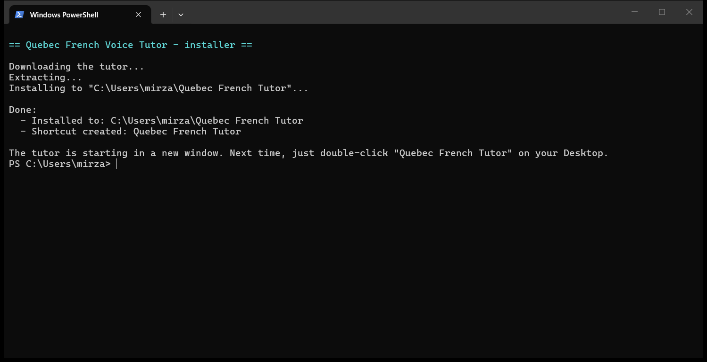

3. The new **Quebec French Tutor** window gets Node.js (if needed), then asks for your key:

   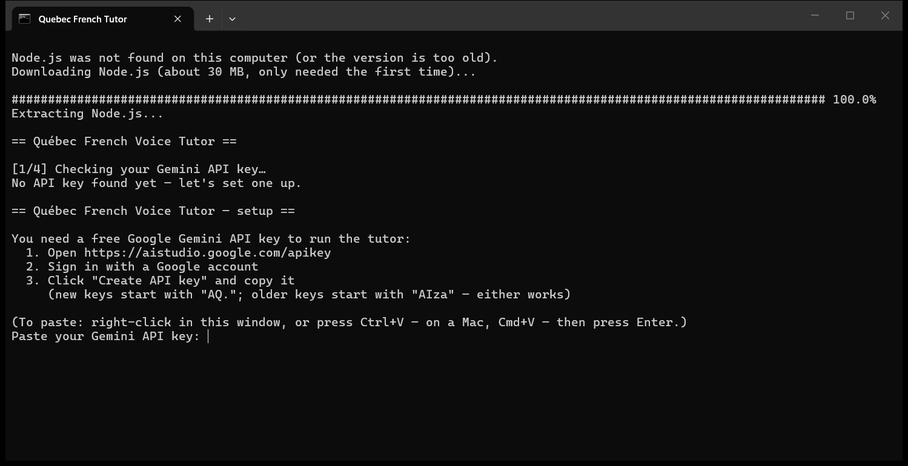

   **Paste your key** (right-click in the window, or press **Ctrl+V**) and press **Enter**.
   The characters you paste stay visible; that's normal. The launcher checks the key with
   Google and saves it.
4. The first start then installs the tutor's components (1–3 minutes, with no progress
   bar; just wait). When it says **The tutor is running**, your browser opens at
   **<http://localhost:3000>**.

   

5. Continue with [Your first conversation](#step-3--your-first-conversation).

> [!IMPORTANT]
> **Leave the Quebec French Tutor window open** while you practise; it *is* the tutor.
> You can minimise it. You can close the PowerShell window from step 1; you won't need it again.

<details>
<summary><b>Alternative: download the ZIP instead</b> (more steps)</summary>

<br>

The pasted line above is the easiest way: it avoids Windows' security prompts and makes
the Desktop icon for you. Use the ZIP only if you can't use PowerShell. It needs one
extra Windows step, and you start the tutor from the folder instead of a Desktop icon.

1. On <https://github.com/mkazbekov/French_Quebecois_Agent> click the green **Code**
   button, then **Download ZIP**.

   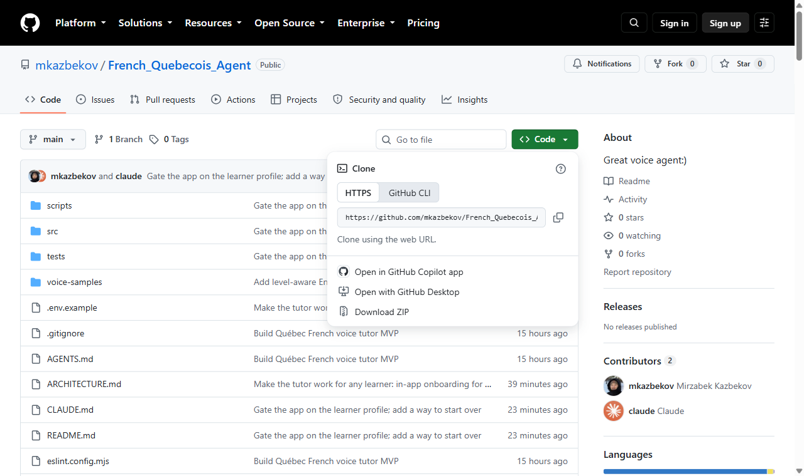

2. **Important: unblock the ZIP first.** Open your **Downloads** folder, right-click
   **French_Quebecois_Agent-main.zip**, choose **Properties**, tick **Unblock** at the
   bottom, and click **OK**. Without this, Windows 11 with Smart App Control turned on
   refuses to run the launcher (*"An Application Control policy has blocked this file"*),
   and other PCs may show a *"Windows protected your PC"* or security warning first.

   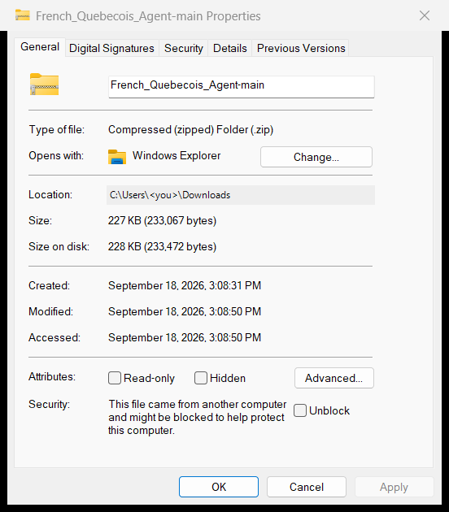

3. Right-click the ZIP again, choose **Extract All…**, then **Extract**.
4. In the extracted folder, double-click **Start Tutor (Windows).bat**. From step 3 on,
   it's the same as the installer above. Next time, double-click the same file again.

</details>

---

## Step 2 (macOS) — Install and start

⏱️ About 5 minutes the first time.

1. Press **⌘ Command + Space**, type **Terminal**, and press **Return**. A window opens.
2. Copy this whole line, paste it into Terminal (**⌘ Command + V**), and press **Return**:

   ```bash
   curl -fsSL https://raw.githubusercontent.com/mkazbekov/French_Quebecois_Agent/main/install-mac.sh | bash
   ```

   This downloads the tutor into a folder called **Quebec French Tutor** in your home
   folder, and puts a **Quebec French Tutor** icon on your Desktop. Then it starts the tutor.
3. It gets Node.js (if needed), then asks: **Paste your Gemini API key:**. Paste your
   key (**⌘ Command + V**) and press **Return**. The launcher checks it with Google and
   saves it.
4. The first start installs the tutor's components (1–3 minutes, with no progress bar;
   just wait). When it says **The tutor is running**, your browser opens at
   **<http://localhost:3000>**.
5. Continue with [Your first conversation](#step-3--your-first-conversation).

> [!IMPORTANT]
> **Leave the Terminal window open** while you practise; it *is* the tutor. You can
> minimise it. It shows the same messages as the Windows screenshots above.

> [!NOTE]
> **Tested so far:** the macOS installer and launcher were run end to end on Linux, which
> uses the same script code apart from the Node.js download. They have not yet been run
> on a real Mac. If anything differs on yours, please open an issue.

**Why a Terminal command instead of a download?** macOS blocks double-clickable scripts
downloaded with a browser (*"Apple could not verify … is free of malware"*). Files the
installer downloads itself are not blocked, so the Desktop icon just works.

<details>
<summary><b>Alternative: download the ZIP instead</b> (more steps)</summary>

<br>

The Terminal line above is easier. The ZIP route needs a trip to System Settings to let
the launcher run, and it doesn't make a Desktop icon.

1. On <https://github.com/mkazbekov/French_Quebecois_Agent> click **Code → Download ZIP**.
   Safari unzips it into your Downloads folder automatically.
2. Open the **French_Quebecois_Agent-main** folder and double-click
   **Start Tutor (Mac).command**.
3. macOS will say it *can't be opened* or *could not verify* it. Click **Done** (not
   *Move to Trash*). Open **System Settings → Privacy & Security**, scroll down to the
   message about *Start Tutor (Mac).command*, click **Open Anyway**, and confirm with your
   password or Touch ID. You only do this once.
4. From step 3 of the installer above, it's the same.

</details>

---

## Alternative (Windows or Mac) — if you already use Git

If Git is installed, you can clone the repository instead. You don't need a GitHub
account. Files that Git downloads aren't blocked by Windows or macOS, so no unblocking
or *Open Anyway* step is needed.

```bash
git clone https://github.com/mkazbekov/French_Quebecois_Agent.git
```

Then open the **French_Quebecois_Agent** folder and double-click **Start Tutor
(Windows).bat** or **Start Tutor (Mac).command**. From step 3 of the installer it's the
same. There is no Desktop icon; start the tutor from that file each time. To update,
close the tutor and run `git pull` in that folder. Your key (`.env`) and progress are
kept.

---

## Step 3 — Your first conversation

The browser opens **<http://localhost:3000>** by itself. If it doesn't, open that address
yourself. `localhost` means "this computer": the tutor's page comes from the launcher
window, not from the internet.

1. **Your name.** Type what the tutor should call you and click **Continue**.

   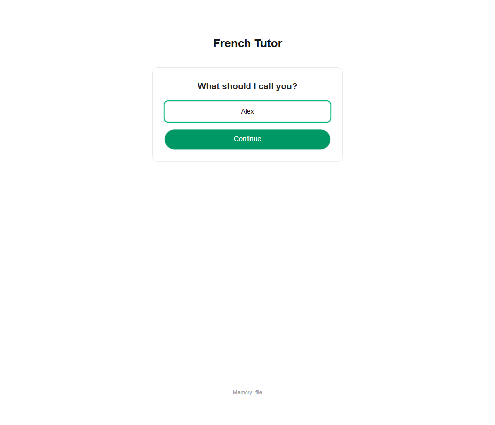

2. **Your level.** Pick the button closest to your French. If you're unsure, click
   **Not sure — find my level**: your first call is then a short, relaxed placement chat
   that works it out for you.

   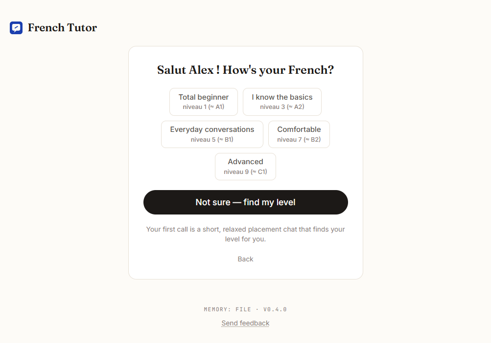

   You're asked these two things only once. Both are saved, and you can change them
   later under **Profile**.
3. **Turn your sound on.** Check that your speakers aren't muted and the volume is up.
   Headphones work best.
4. Press **Start Conversation**.

   

5. **Allow the microphone.** The browser asks to use your microphone. Click
   **Allow while visiting the site** (Chrome) or **Allow** (Edge). If you have more than
   one microphone, pick the right one in the drop-down menu first.

   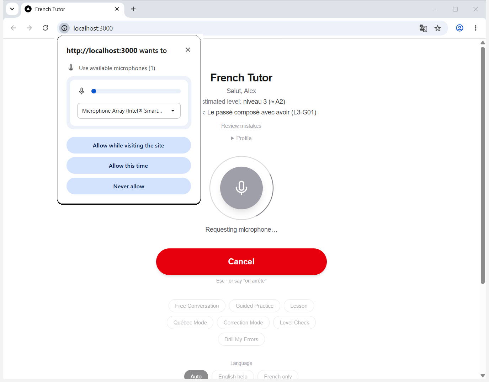

   **On a Mac, the first time only**, macOS also asks *"Google Chrome would like to access
   the microphone"*. Click **Allow** (or **OK**).
6. **The tutor speaks first.** Within a few seconds the circle turns blue
   (**Speaking…**) and you hear a greeting. Its words also appear in the **Transcript**
   box.
7. **Answer out loud.** When the circle is green (**Listening…**), talk normally.
   Your words appear in a green bubble on the right, and the tutor replies. Take your
   time: the tutor waits through pauses.

   

   ✅ **It works if** you heard the greeting *and* your own words appeared in a green
   bubble. If either is missing, see [Troubleshooting](#troubleshooting).

8. **Hang up** when you're done: press **End Conversation**, press **Esc**, or just say
   *"on arrête"* / *"I have to go"*. A short summary appears and your progress is saved.
   The first review can take up to a minute. You can close the tab; nothing is lost.

   

🎉 **That's it.** From now on, just follow [How to use it](#how-to-use-it).

---

## Stopping, updating and uninstalling

**Stopping:** close the tutor window. On a Mac, if Terminal asks *"Do you want to
terminate running processes?"*, click **Terminate**. Your progress is already saved.
On Windows the icon is also in the Start menu.

If the browser tab was closed but the window is still open, just open
<http://localhost:3000> again. Double-clicking the icon while the tutor is already
running also just opens the page.

### Updating

**You don't have to do anything special — just start the tutor as usual.**

Every time you double-click **Quebec French Tutor**, the launcher checks whether a newer
version exists (it asks GitHub for one small file and sends nothing about you). If there
is one, the window shows what's new and asks:

```text
A new version is available (v0.3.0 — you have v0.2.0)
  - Real-time transcript
  - Multiple-choice checks during lessons
Update now? [Y/n]
```

Press **Enter** to update. It takes a few seconds, then the tutor starts on the new
version. Your **API key, your progress and your settings are kept** — only the program
files are replaced. Press **n** if you'd rather stay on the version you have; you'll be
asked again next time.

The version you're running is shown in small grey text at the bottom of the tutor's
page, next to *Memory* and *Voice*. [CHANGELOG.md](CHANGELOG.md) lists what changed in
each version.

<details>
<summary><b>Other ways to update</b></summary>

<br>

- **If you skipped the prompt and want to update now:** close the tutor, double-click the
  icon again, and press Enter at the question.
- **Manually, from the tutor's folder:** `npm run update`
- **The old way (always works):** close the tutor window and paste the same one-line
  install command from [Step 2](#step-2-windows--install-and-start) again. It replaces
  the program and keeps your key and progress.
- **If you installed with Git:** run `git pull` in the tutor's folder.
- **To turn the check off:** set the environment variable `TUTOR_NO_UPDATE_CHECK=1`.
  The tutor never updates itself without asking, and never while it is running.

</details>

### Uninstalling

Close the tutor, then delete the **Quebec French Tutor** folder in your user/home folder
and the Desktop (and Windows Start menu) icon. That removes everything, including your
saved progress. To also revoke the key, open the AI Studio API Keys page, click **⋮** at the
end of the key's row, choose **Delete key**, then **Delete**.
---

## Troubleshooting

Click a problem to see the fix.

<details>
<summary>🎤 <b>The browser says the microphone is blocked</b></summary>

<br>

The page shows: *"The browser blocked the microphone…"*

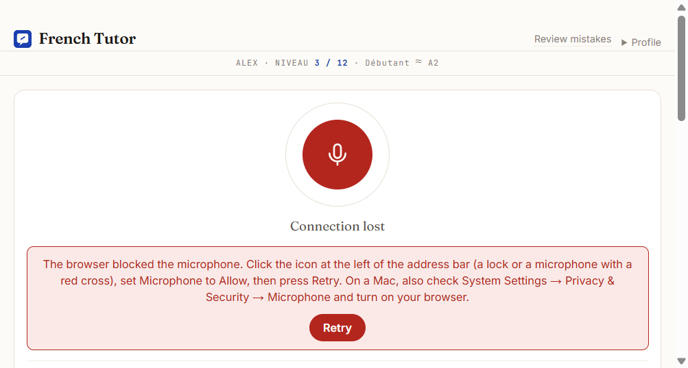

- **Chrome / Edge:** click the icon at the left end of the address bar (next to
  `localhost:3000`), set **Microphone** to **Allow**, and press **Retry**. If there is no
  such option, open `chrome://settings/content/microphone` (Edge:
  `edge://settings/content/microphone`), remove `localhost:3000` from *Not allowed*, and
  reload the page.
- **Mac:** open **System Settings → Privacy & Security → Microphone**, switch on
  **Google Chrome** (or your browser), then quit and reopen the browser.
- **Windows:** open **Settings → Privacy & security → Microphone**, and switch on
  **Microphone access** and **Let desktop apps access your microphone**.

</details>

<details>
<summary>🔇 <b>"No microphone was found" or the tutor can't hear you</b></summary>

<br>

- Plug in your headset or microphone and press **Retry**.
- Make sure the right microphone is selected. In Chrome/Edge, click the icon left of the
  address bar, then **Site settings**, and choose the device, or pick it in the permission
  prompt's drop-down.
  - **Windows:** **Settings → System → Sound → Input**: choose your microphone and
    speak to see the level bar move.
  - **Mac:** **System Settings → Sound → Input**: choose your microphone and watch the
    input level.
- If the message says the microphone is *used by another app*, close Zoom, Teams, etc.
  and press **Retry**.

</details>

<details>
<summary>🔈 <b>I can't hear the tutor</b></summary>

<br>

- The transcript shows the tutor's words but you hear nothing: check that your
  computer isn't muted and that the browser tab isn't muted (right-click the tab; if it
  says **Unmute site**, click it).
- Choose the right speakers or headphones: **Windows:** **Settings → System → Sound →
  Output**; **Mac:** **System Settings → Sound → Output**. Then press **End
  Conversation** and start again.
- Bluetooth headphones sometimes switch to a low-quality "headset" mode when the
  microphone is on. If the sound is bad, use the computer's built-in microphone.

</details>

<details>
<summary>🔑 <b>"Google rejected your Gemini API key"</b></summary>

<br>


The key was mistyped, deleted, or restricted. Close the tutor window and start it again
from the Desktop icon: the launcher checks the key every time and asks for a new one if
Google rejects it. Get a fresh key as in [Step 1](#step-1--get-your-free-gemini-api-key).

Common key mistakes:

- **Only part of the key was copied.** Use the **Copy key** button rather than selecting
  the text by hand.
- **Extra text pasted**, such as `GEMINI_API_KEY=` or quotes. Paste the key only.
- **The key was deleted** in AI Studio, or it shows a **Blocked** tag there. Create a new one.
- **Wrong kind of key.** It must come from Google AI Studio (aistudio.google.com), not
  from another Google Cloud product.

</details>

<details>
<summary>🔑 <b>"No Gemini API key is set up yet"</b></summary>

<br>

Close the tutor window and start it again; the launcher asks for the key.

</details>

<details>
<summary>⏳ <b>"Gemini's free quota is used up for now"</b></summary>

<br>

The free tier has per-minute and per-day limits. Wait a minute, or until the next day.
You can see your limits on the AI Studio **Rate Limit** page.

</details>

<details>
<summary>⚠️ <b>The launcher window shows an error and stays open</b></summary>

<br>

Read the last lines; they say what went wrong. The most common causes:

- **No internet** during the first start (downloading Node.js or the components). Connect
  and start again.
- **Antivirus** blocked the download. Allow it, or install Node.js yourself from
  <https://nodejs.org> (the "LTS" button) and start again.
- **A folder name containing `&`** (Windows only). Move the folder somewhere without `&`
  in its path.

</details>

<details>
<summary>🌐 <b>The browser opened something else, or the page doesn't load</b></summary>

<br>

If another program already uses port 3000, the tutor picks the next free one (3001,
3002…). Use the exact address printed in the tutor window after *The tutor is running at*.

</details>

### Browsers

We tested **Google Chrome** on Windows 11. Microsoft Edge uses the same engine as Chrome.
Firefox and Safari may work but were not tested. If something misbehaves in them,
use Chrome or Edge.

---

## Using the tutor

**Ending a call.** Any of these hangs up:

- **Say so.** "On arrête", "je dois y aller", "bye", "I have to go". The tutor says a
  short goodbye and the call hangs up by itself once the goodbye has finished playing.
  Saying "au revoir" to a character in a role-play does not end the call. If the tutor
  isn't sure, it asks "On arrête là pour aujourd'hui ?".
- **Press End Conversation**, or press **Esc**.
- **Cancel** while it is still connecting. The same red button, or Esc, stops it and
  nothing is saved.

A "Call ended, saving your progress" screen replaces the call while the review runs,
which can take up to a minute or two. You don't have to wait: the session is kept in the
browser first, so you can close the tab and it will be reviewed the next time you open
the app. Very short calls (fewer than two answers from you) are not reviewed.

**What the calls do.** Your very first call is a friendly **placement** (unless you
picked your level): the tutor checks all four skills (listening, speaking, reading,
writing) so it knows where to start. After that, calls rotate automatically through
practice, a lesson, a Québec role-play, practice, a lesson, and a level check.

**Live transcript.** Everything said in the call is written out under the buttons **as it
is spoken** — your words and the tutor's, word by word while they come in (the faint grey
line with a blinking cursor is the sentence still being said). Use it to read along, to
catch a word you missed, or to answer something the tutor asks you to *read*.

**Multiple-choice checks.** During lessons, level checks and drills the tutor will
sometimes put a short question with two to four options on your screen — and say it out
loud too. Answer however you like: **say it**, **type it**, or **click an option** (or
press `1`–`4`). The card turns the right answer green straight away, and the tutor picks
the conversation back up from your answer.

**Text box.** Under the transcript there is a text field. The tutor will sometimes ask
you to *type* an answer (that is how it assesses your writing) or to *read* what it just
said on screen (reading). You can also type any time instead of speaking.

**Mode buttons** (optional, under the Start button) choose the style of the next call.
If you don't pick one, the tutor chooses for you.

| Button | What the call is like |
| --- | --- |
| 💬 **Free Conversation** | fluency first, light corrections |
| 🧭 **Guided Practice** | the conversation is steered toward your current focus |
| 📘 **Lesson** | one grammar point explained and drilled, three to five new words, then used live |
| 🍁 **Québec Mode** | role-play of one Montréal situation (dépanneur, STM, landlord, winter…) |
| ✏️ **Correction Mode** | explicit one-line corrections after each clear error |
| 📊 **Level Check** | checks your level in all four skills; no score is announced |
| 🎯 **Drill My Errors** | a targeted drill on your recurring errors |

**Language switch** (how much English the tutor uses):

| Setting | English used |
| --- | --- |
| **Auto** (default) | follows your level. At niveau 1–2 the tutor is fully bilingual and teaches French in small steps. At niveau 3–4 it leads in French with English on standby. From niveau 5 it stays in French. |
| **English help** | keeps the bilingual style regardless of level |
| **French only** | French all the way, English only for a rare quick gloss |

You can also just ask the tutor out loud ("explain in English", "on continue en français").

**Review mistakes** (link at the top) shows your level per skill, your progress through
the program, recurring errors, vocabulary being recycled, grammar points, and the
current focus.

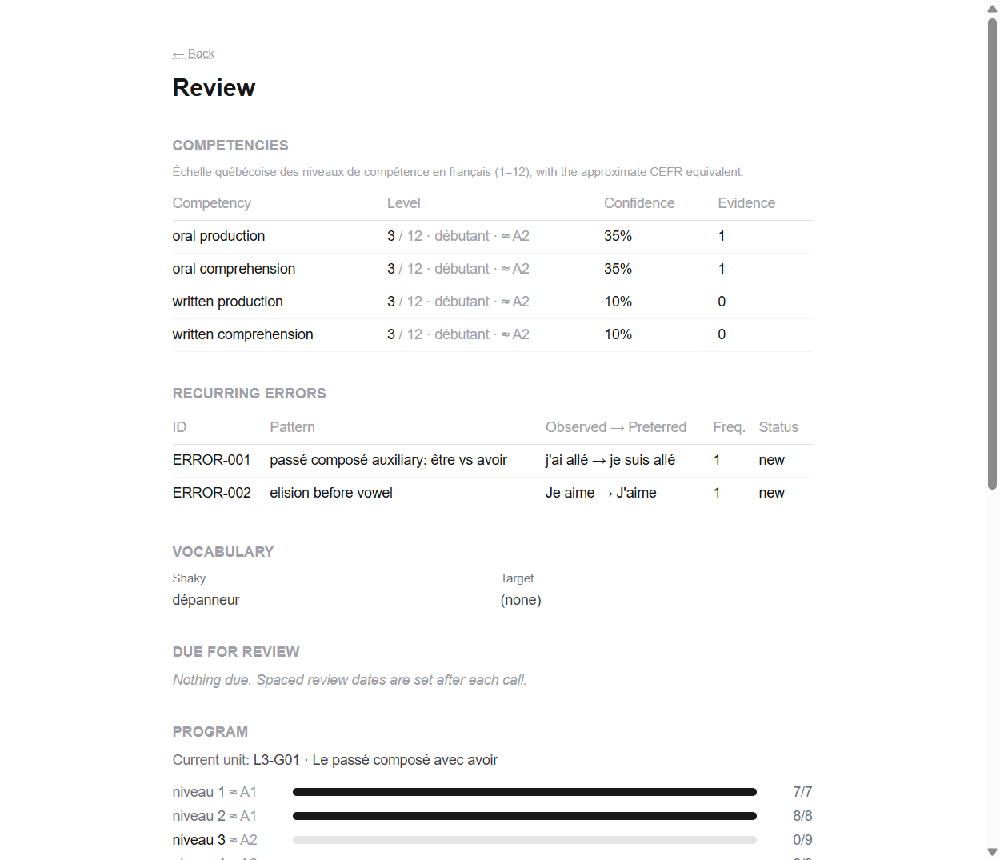

**Profile** (under the header) lets you change your name, pick a different level, or
**Retake the level test** (your next call becomes a placement chat; progress is kept).
**Delete profile & start over** wipes your name, level, progress and mistakes and shows
the first-time questions again.

### Levels

Progress is tracked on the **Échelle québécoise des niveaux de compétence en français**
(12 levels, four skills: compréhension orale, production orale, compréhension écrite,
production écrite). The approximate CEFR equivalent is shown next to every level.

| Échelle québécoise | stage         | CEFR ≈ |
| ------------------ | ------------- | ------ |
| 1–2                | débutant      | A1     |
| 3–4                | débutant      | A2     |
| 5–6                | intermédiaire | B1     |
| 7–8                | intermédiaire | B2     |
| 9–10               | avancé        | C1     |
| 11–12              | avancé        | C2     |

After placement (or your own pick), levels only ever move one step per call, and only
once there is enough evidence.

### The program and how it adapts

There is a fixed syllabus behind the calls: for each of the 12 levels, a list of units
(grammar, things you do with the language, vocabulary themes, Québec usage and culture),
each with a stable id like `L3-G02`. Guided practice and lessons are built around the
**current unit**. A unit is marked done after two calls where you used it well; then the
program moves on. Gaps from lower levels are filled before moving up.

- **Errors point at units.** Every recorded error is linked to the unit that teaches the
  fix. Once an error keeps coming back, that unit moves to the front.
- **Spaced review.** Errors, vocabulary and finished units come back for review at
  growing intervals (days, then weeks).
- **Remediation calls.** When two or more recurring errors are due, the next automatic
  call is a drill on them.
- **Confidence decay.** Skills that haven't been observed lately lose a little
  confidence; when it gets low, the next automatic call is a level check.

### Privacy

Everything stays on your computer; nothing is collected by anyone. Raw transcripts are
never saved — only compact learning notes (error patterns, vocabulary, level estimates,
short summaries), in the `data` folder inside the tutor folder, with your key in `.env`
beside it. The full statement is in [Your privacy](#-your-privacy).

---

## 💬 Send feedback

Something confusing, broken, or missing? Tell me — it takes ten seconds.

At the bottom of the tutor's page, click **Send feedback**, type what's on your mind,
and (optionally) leave your email so I can reply. Press **Send**. If you leave an email
address you'll get an automatic confirmation right away, and a real answer from me after
that.

What I receive: **the text you typed**, your email address if you gave one, and — only if
you tick the box — the app version, your operating system and which voice service you're
on. Nothing else. No transcript, no progress, no key. See
[Your privacy](#-your-privacy).

You can also just email **<mjkazbekov@gmail.com>** directly, or open an issue on
[GitHub](https://github.com/mkazbekov/French_Quebecois_Agent/issues).

<details>
<summary><b>For the maintainer: turning on delivery and auto-replies</b></summary>

<br>

Out of the box the form opens a pre-filled draft in the learner's own mail app, because
the tutor ships with no server and no credentials. To have it send directly — and to
auto-reply to whoever wrote — deploy the small Google Apps Script relay in
[`docs/feedback-relay.gs`](docs/feedback-relay.gs) on your own Google account and put its
URL in `.env`:

```dotenv
FEEDBACK_ENDPOINT=https://script.google.com/macros/s/…/exec
```

Full steps are in [docs/FEEDBACK.md](docs/FEEDBACK.md).

</details>

---

## For developers

Requirements: Node.js 20.9+ and npm. Clone the repo, then:

```bash
npm install
npm run dev        # first run asks for the Gemini key and writes .env
```

Open <http://localhost:3000>. `npm run start:app` runs the same launcher the one-click
scripts use (key check, install if needed, start, open browser).

| command                       | purpose                                                                    |
| ----------------------------- | -------------------------------------------------------------------------- |
| `npm run dev`                 | start the tutor at http://localhost:3000 (asks for a key the first time)   |
| `npm run start:app`           | the one-click launcher: verify key, install deps, start, open the browser  |
| `npm run setup`               | add or replace your Gemini API key in `.env`                               |
| `npm run build && npm start`  | production build / serve                                                   |
| `npm test`                    | unit tests                                                                 |
| `npm run typecheck`           | TypeScript                                                                 |
| `npm run lint`                | ESLint                                                                     |
| `npm run verify:persistence`  | writes learner state, re-reads it from a fresh process, reports PASS/FAIL  |
| `npm run reset:profile`       | deletes the current learner's stored profile (`--yes` skips the prompt)    |
| `npm run check:gemini-setup`  | confirms the Live API accepts the exact setup message the browser sends    |
| `npm run check:gemini`        | live 3-turn text→speech session against Gemini Live (no mic)               |
| `npm run check:review`        | live structured session review with the configured provider               |
| `npm run check:realtime`      | same protocol check for the OpenAI backend (needs credits)                 |
| `npm run update`              | download and apply the latest version in place (keeps `.env` and `data`)   |
| `npm run check:update`        | report whether a newer version has been published                          |
| `pwsh -File scripts/make-icons.ps1` | re-render `assets/*.png` + `assets/tutor.ico` from the logo path data |

**Launch files** (repo root):

| file                         | what it does                                                                 |
| ---------------------------- | ---------------------------------------------------------------------------- |
| `install-windows.ps1`        | one-line Windows installer: download, install to `~\Quebec French Tutor`, shortcuts, start |
| `install-mac.sh`             | one-line macOS installer: download, install to `~/Quebec French Tutor`, Desktop icon, start |
| `Start Tutor (Windows).bat`  | finds Node ≥ 20.9 or downloads a portable copy into `.runtime/`, then runs `scripts/launch.mjs` |
| `Start Tutor (Mac).command`  | the same for macOS (and Linux)                                              |
| `scripts/launch.mjs`         | verify key (re-ask if Google rejects it) → `npm ci` if needed → `next dev -H 127.0.0.1` → open browser |

The launcher binds the server to `127.0.0.1`, so the API routes (which spend your key)
are not reachable from other machines on your network.

**Optional settings** in `.env` (`.env.example` lists them all with comments):

| variable         | what it does                                                                                     |
| ---------------- | ------------------------------------------------------------------------------------------------ |
| `LETTA_API_KEY`  | Keep learner memory in [Letta Cloud](https://app.letta.com) instead of `./data/`.               |
| `LETTA_BASE_URL` | Use a self-hosted Letta server instead (e.g. `http://localhost:8283`).                          |
| `OPENAI_API_KEY` | Use OpenAI Realtime for the voice (`VOICE_PROVIDER=openai`, paid account).                      |
| `LEARNER_ID`     | Keeps separate learners' progress apart on one machine / Letta account (default `learner`).     |

The page footer shows which voice provider and memory backend are active.

**How it works:** see [ARCHITECTURE.md](ARCHITECTURE.md). In short: voice is **Gemini
Live** (`gemini-3.8-live`, raw WebSocket + Web Audio, one ephemeral token per call; the
real key never reaches the browser), or OpenAI Realtime behind the same button. Learner
memory is Letta or a local JSON file. At the end of a call a structured review model
reports observations, and deterministic code merges them into the learner profile.
